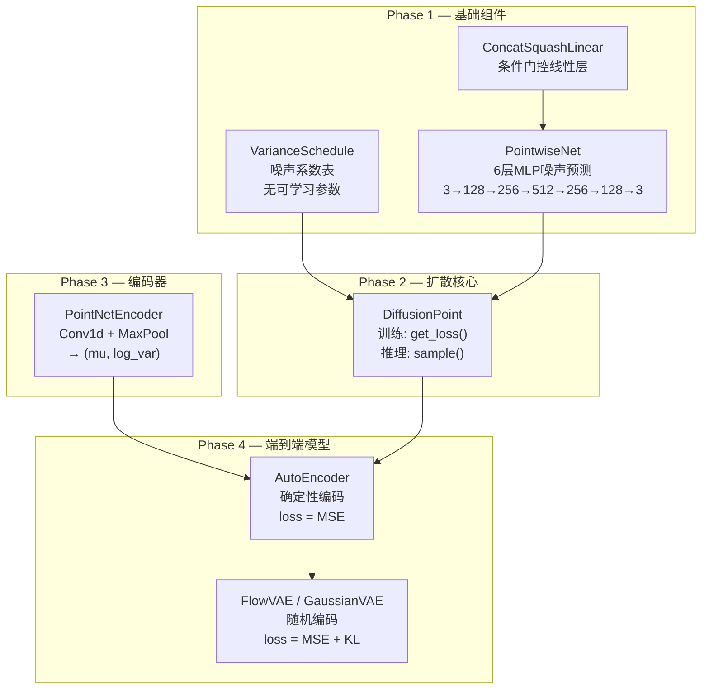
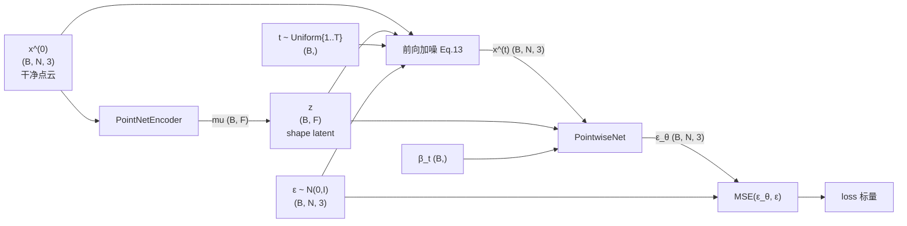
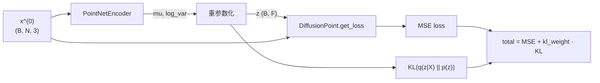
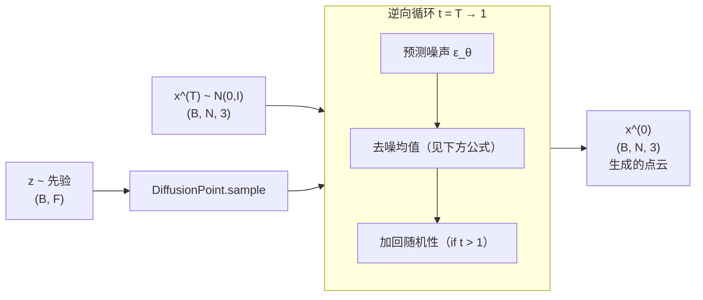

# DPM-3D 全局架构文档

> Paper: Luo & Hu, "Diffusion Probabilistic Models for 3D Point Cloud Generation", CVPR 2021
> 各组件详细导读见 `docs/code_guide/` 下对应文档

---

## 模块总览

---

## 数据流图

### 训练（AutoEncoder 模式）

### 训练（FlowVAE 模式）

### 推理（采样）

> **逆向去噪公式**（对应 DDPM Eq.11）：
>
> $$x^{(t-1)} = \frac{1}{\sqrt{\alpha_t}} \left( x^{(t)} - \frac{1 - \alpha_t}{\sqrt{1 - \bar\alpha_t}}\, \varepsilon_\theta \right) + \sigma_t \cdot z, \quad z \sim \mathcal{N}(0, I)$$

---

## 各模块输入/输出速查

| 模块 | 方法 | 输入 | 输出 | 详细文档 |
|------|------|------|------|---------|
| `VarianceSchedule` | `__init__` | `T`, `beta_T` | — | [01](code_guide/01_variance_schedule.md) |
| | `uniform_sample_t` | `batch_size` | `t: (B,)` 1-indexed | |
| | `get_sigmas` | `t: (B,)`, `flexibility` | `sigma: (B,)` | |
| `ConcatSquashLinear` | `forward` | `x: (B, N, in)`, `ctx: (B, 1, ctx)` | `out: (B, N, out)` | [02](code_guide/02_concat_squash_linear.md) |
| `PointwiseNet` | `forward` | `x: (B, N, 3)`, `beta: (B,)`, `z: (B, F)` | `eps_pred: (B, N, 3)` | [03](code_guide/03_pointwise_net.md) |
| `DiffusionPoint` | `get_loss` | `x0: (B, N, 3)`, `z: (B, F)` | `loss: 标量` | [04](code_guide/04_diffusion_point.md) |
| | `sample` | `z: (B, F)`, `num_points`, `flexibility` | `x: (B, N, 3)` | |
| `PointNetEncoder` | `forward` | `x: (B, N, 3)` | `mu, log_var: (B, F)` | Phase 3 待实现 |
| `AutoEncoder` | `forward` | `x: (B, N, 3)` | `loss: 标量` | Phase 4 待实现 |
| | `sample` | `z: (B, F)`, `num_points`, `flexibility` | `x: (B, N, 3)` | |

---

## 关键设计决策汇总

| 决策 | 原因 | 详细记录 |
|------|------|---------|
| 时间嵌入用 `[β, sin(β), cos(β)]`（3维）而非 DDPM 的 128 维 | MLP 结构不需要高维嵌入；β 本身就是噪声强度语义 | [paper_deep_dive §2](notes/paper_deep_dive.md) |
| 两种方差用 flexibility 插值 | 不硬选一个，把生成多样性控制权留给用户 | [paper_deep_dive §1](notes/paper_deep_dive.md) |
| register_buffer 存噪声系数 | 固定常数不参与优化，但需跟模型移动到 GPU | [pytorch_notes §1](notes/pytorch_notes.md) |
| PointwiseNet 用残差连接 | 网络只学偏差量，训练更容易；梯度沿捷径流回 | [pytorch_notes §2](notes/pytorch_notes.md) |
| 条件注入用 ConcatSquashLinear 而非简单拼接 | 门控机制比拼接更有表达力（待详细展开） | [paper_deep_dive §3 占位](notes/paper_deep_dive.md) |
| Encoder 输出 log_var 而非 sigma | 数值稳定性（log 域避免负数和极值） | CLAUDE.md |
| 训练时随机采 t 而非遍历 | 等价于均匀重要性采样，O(T) → O(1) | [04](code_guide/04_diffusion_point.md) |
| `F.mse_loss` 而非手写 `** 2` | 避免 `^`（按位异或）vs `**`（幂）的 Python 陷阱 | [04](code_guide/04_diffusion_point.md) |
